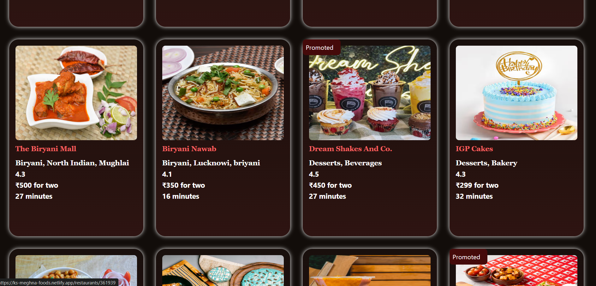
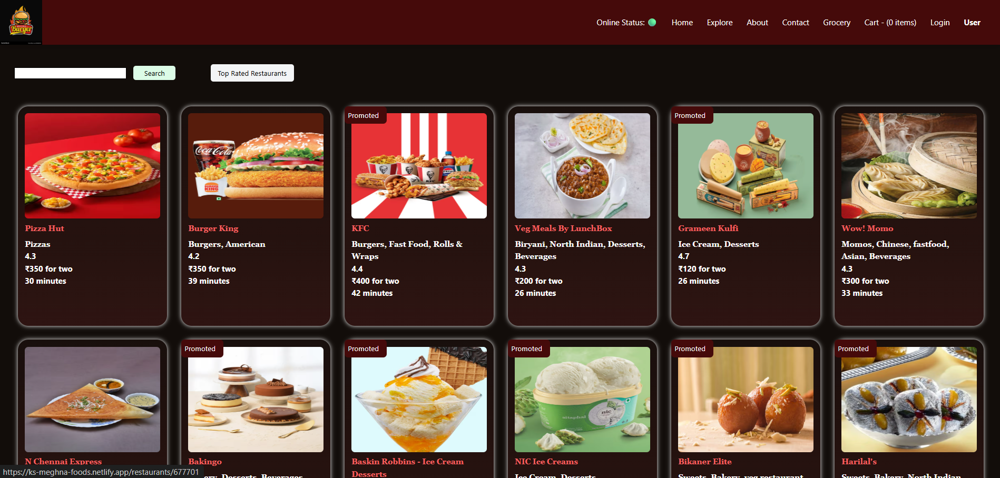

---

# 🙏  — KS Meghna Foods 🍴

### 🚀 Food Ordering App (Frontend Project)

A **Frontend Food Delivery Application** built using **React JS** and **Swiggy’s Live API**.
Beautifully designed and optimized with **Tailwind CSS**, **Redux Toolkit**, and **Parcel Bundler**.

---

## ⚙️ Tech Stack

* **Frontend Library:** React JS
* **Bundler:** Parcel
* **Styling:** Tailwind CSS
* **State Management:** Redux Toolkit
* **Testing:** Jest

---

## ✨ Features

✅ Shimmer UI for better loading experience
✅ Add to Cart functionality
✅ Fetch live restaurant data using Swiggy API (based on current location)
✅ Display restaurant details — Area name, Cuisines, Category & Ratings
✅ Search restaurants by name
✅ Explore restaurant menu with item details & price per quantity
✅ Filter Top Rated Restaurants

---

## 🧑‍💻 How to Run Locally

1️⃣ **Clone the repository**

```bash
git clone https://github.com/keshav-sharma786/90-Days-Of-Hard-Grind/tree/main/MeghnaFoods/NamasteReactEP04.git
```

2️⃣ **Install dependencies**

```bash
npm install
```

3️⃣ **Start the development server**

```bash
npm start
```

> 💡 **Note:** Make sure you have the **CORS extension enabled** in your browser while fetching Swiggy Live API data.

---

## 🌟 Show Some Love

If you like this project, don’t forget to **drop a ⭐** on the repository!

---

## 🖼️ Screenshots

### 🏠 Home Page


### ℹ️ About Page


### 🔍 Explore Page







### 🍽️ Restaurant Menu Page


### 🛒 Cart Page


---

### 💖 Support This Project

## Thank you for checking out KS Meghna Foods!

Building this has been a wonderful learning experience, and I’m truly grateful for the opportunity to share it with the community.

Your feedback, stars ⭐, and contributions mean a lot — they keep this project alive and evolving!

If you have any questions, ideas, or suggestions, feel free to connect. Let’s learn, build, and grow together 🚀

<Happy coding />

## 🙏 Thank You for Your Support! 🙏
Made with ❤️ and React