# NextFlyNovaGPT🚀

- Created Project with Vite Bundler.
- Configured TailwindCSS into the project.
- Header
- routing of App
- Login Form
- Sign up Form
- Form Validation
- useRef Hook
- Firebase Setup
- Deploying App To Production
- Create SignUp User Account
- Implement Sign In User Api
- Created Redux Store with UserSlice
- Implemented Sign out
- Update Profile API
- BugFix: Sign up user displayName and profilePicture update
- if the user is not logged in Redirect / browse to Login Page and vice-versa
- Unsubscribed to the onAuthStateChanged call back
- Add hardcoded values to the constants file.
- Registered TMDB API & create an app & get access token
- Get Data from TMDB now playing movies list API
- Custom Hook for Now PLaying Movies
- Custom Hook for the Elemental Movie
- Create movies Slice
- Create Elemental Movie Slice
- Update Store with movies Data
- Planning for MainContainer & SecondaryContainer
- fetch data for trailer Video
- Update Store with Trailer Video Data
- Embedded the youtube video and make it autoplay
- tailwind classes to make main Container look awesome
- Build Secondary Container
- Build Movie List
- Build Movie Card
- TMDM Image CDN URL
- Made the Browse page amazing with Tailwind CSS
- usePopularMovies Custom Hook
- Implementing Routing for the single page application
- GPT Search Feature
- GPT Search Page
- GPT Search Bar
- (BONUS) Multi-language Feature in our App
- Get Gemini API Call
- fetched gptMovieSuggestions from TMDB
- created gptSlice added data
- Reused MovieList component to make movie suggestion container
- Memoization
- Added .env file
- Adding .env file to gitignore
- Made the web App responsive for small devices

# Features

- Login / Sign Up
- Sign In /Sign up Form
- redirect to Browse Page
- Browse (after authentication)
- Header
- Main Movie
- Trailer in Background
- Title And Description
- MovieSuggestions
- MovieLists \* N

- NextFlyNovaGPT
  - Search Bar
  - Movie Suggestions

# Screenshots

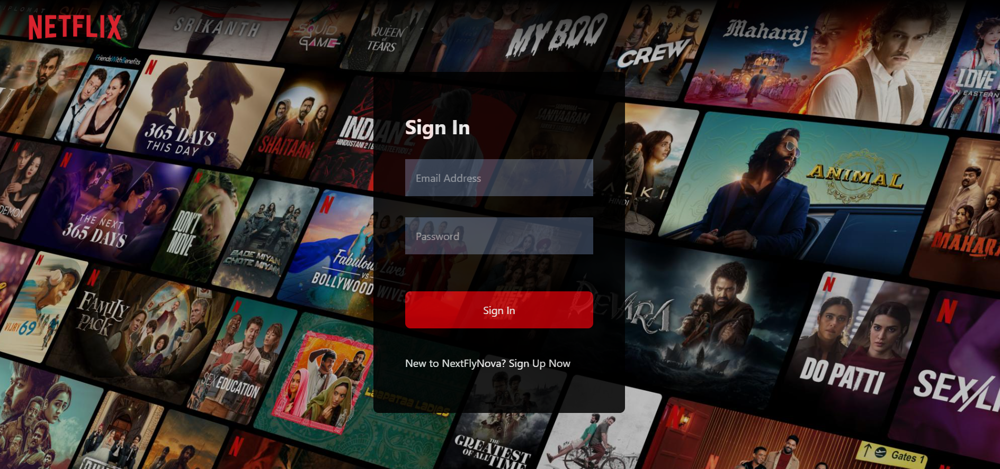

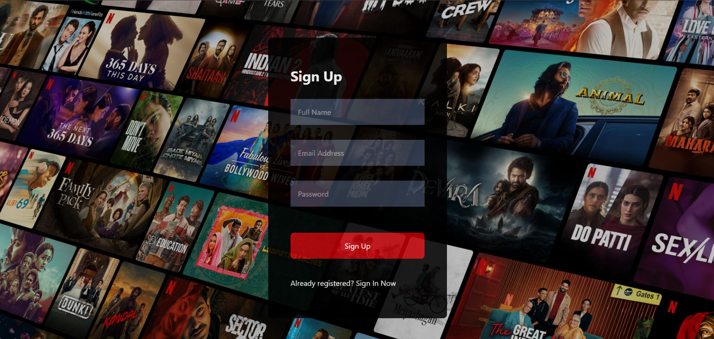

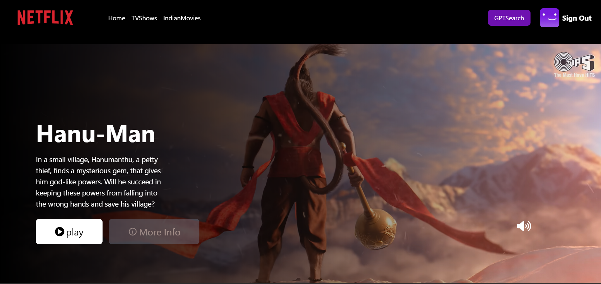

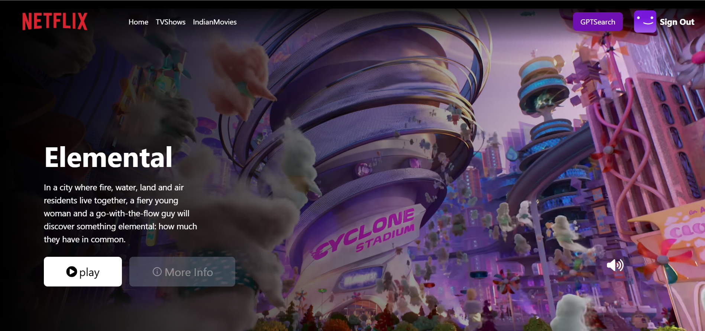

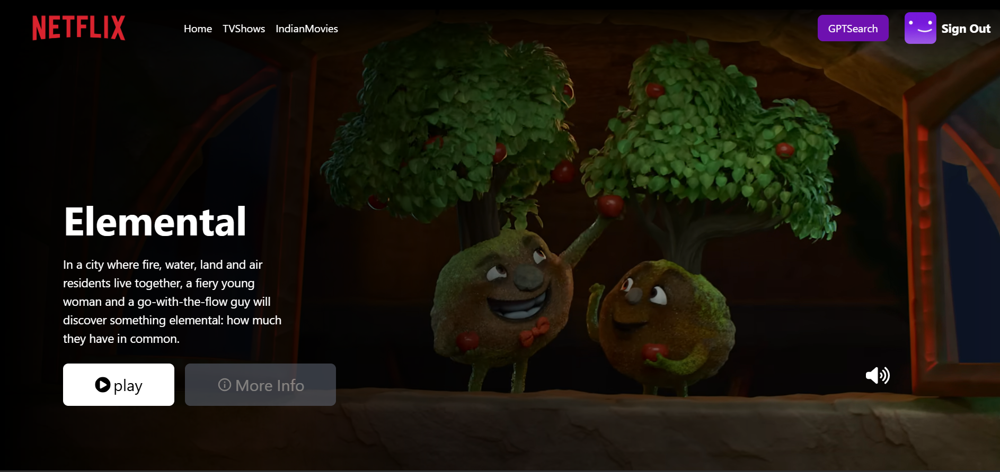

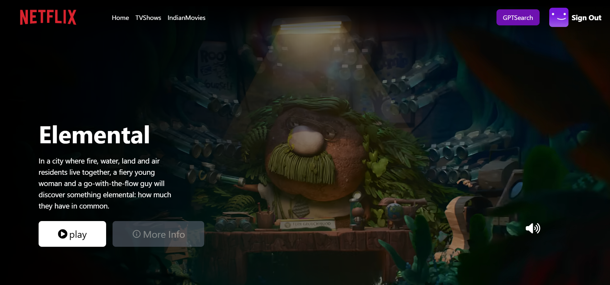

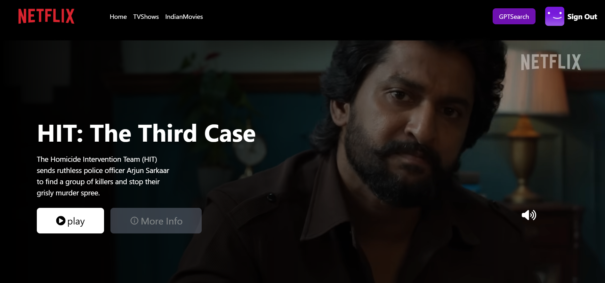

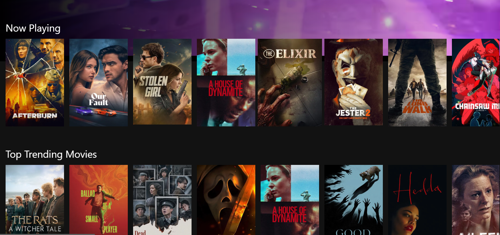

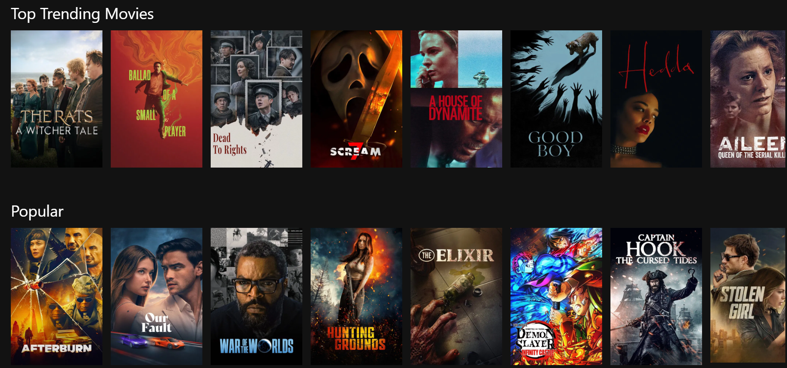

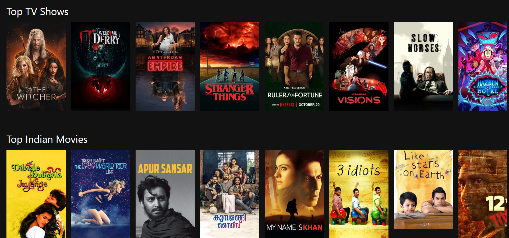

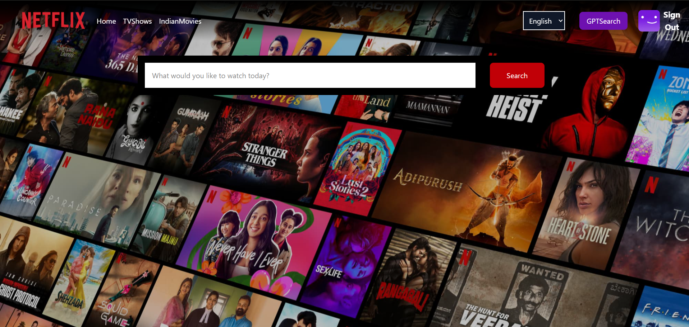

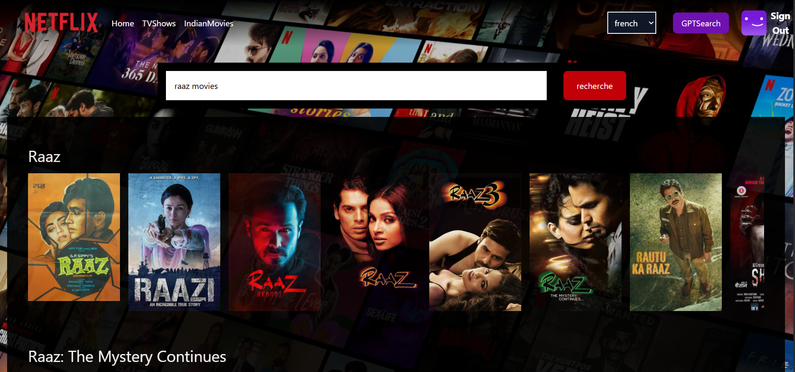
